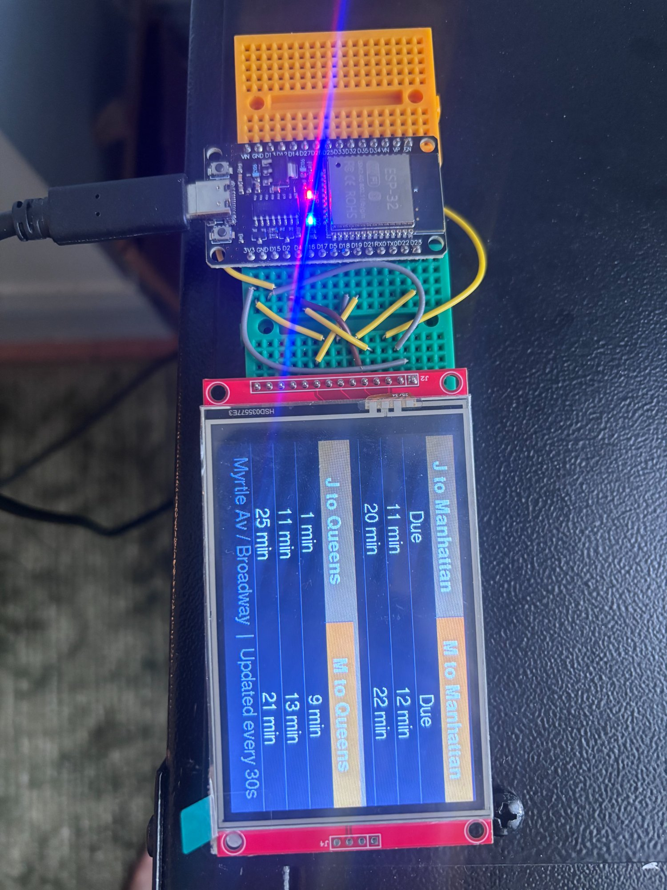

# 🚇 NYC Subway Arrival Display

A real-time NYC subway arrival board built on an **ESP32** microcontroller and a **3.5" TFT display**. Pulls live train data directly from the MTA's GTFS-RT API — no middleman, no app, no phone required. Just plug it in and see when your train is coming.

> Built for the **J/M trains at Myrtle Ave / Broadway** in Brooklyn, but fully configurable for any NYC subway station and up to 4 train lines.

---



---

## ✨ Features

- 🔴 **Live MTA data** — pulls directly from the official MTA GTFS-RT feed
- ⏱️ **Countdown timers** — shows "Due", "3 min", "12 min" etc. in real time
- 🔄 **Auto-refresh** — data updates every 30 seconds, display redraws every 15
- 📶 **WiFi connected** — syncs time via NTP on boot, no battery or RTC needed
- 🛠️ **Fully configurable** — change station, trains, colors, and labels in one section at the top of the sketch
- 🚌 **Supports all NYC subway lines** — J/Z, B/D/F/M, A/C/E, N/Q/R/W, G, L, 1-7, SIR
- 💾 **Standalone** — once uploaded, runs forever from any USB power source

---

## 🛒 Hardware You Need

| Part | Notes |
|------|-------|
| **ESP32 WROOM Dev Board** | Any standard 38-pin ESP32 dev board works |
| **3.5" TFT Display (480×320)** | ILI9488 driver recommended. ILI9341 (320×240) also works with minor layout tweaks |
| **Breadboard** | Mini or half-size is fine |
| **Jumper wires** | Male-to-female, at least 9 wires |
| **USB power supply** | Any 5V USB charger or power bank |

> 💡 **Tip:** Search Amazon or AliExpress for "3.5 inch TFT SPI display ILI9488 Arduino" — usually $8–15.

---

## 🔌 Wiring

Connect the display to the ESP32 using these pins. If your display labels differ, see the translation table below.

### ESP32 → TFT Display

| TFT Pin Label | ESP32 GPIO | Notes |
|---------------|-----------|-------|
| `VCC` | `3.3V` | **Must be 3.3V, NOT 5V** |
| `GND` | `GND` | Any ground pin |
| `CS` | `GPIO 15` | Chip select |
| `RST` | `GPIO 4` | Reset |
| `DC` | `GPIO 2` | Data/Command |
| `SDI` / `MOSI` | `GPIO 23` | SPI data in |
| `SDO` / `MISO` | `GPIO 19` | SPI data out (optional) |
| `SCK` / `CLK` | `GPIO 18` | SPI clock |
| `LED` | `3.3V` | Backlight (share with VCC) |

### Common Pin Label Translations

Different display boards use different labels for the same pins:

| What you might see | What it means |
|--------------------|---------------|
| `SDI`, `MOSI`, `SDA` | Data line → GPIO 23 |
| `SDO`, `MISO` | Return data → GPIO 19 |
| `SCK`, `CLK`, `SCL` | Clock → GPIO 18 |
| `CS`, `CE` | Chip select → GPIO 15 |
| `DC`, `RS`, `A0` | Data/Command → GPIO 2 |
| `RST`, `RES`, `RESET` | Reset → GPIO 4 |
| `LED`, `BL`, `LEDA` | Backlight → 3.3V |

> ⚠️ **Ignore any pins prefixed with `T_`** (e.g. `T_CLK`, `T_CS`, `T_DIN`). Those are for the touchscreen controller and are not used in this project.

---

## 💻 Software Setup

### 1. Install Arduino IDE
Download from [arduino.cc](https://www.arduino.cc/en/software) if you don't have it.

### 2. Add ESP32 Board Support
1. Open Arduino IDE → **File → Preferences**
2. Paste this into "Additional boards manager URLs":
   ```
   https://raw.githubusercontent.com/espressif/arduino-esp32/gh-pages/package_esp32_index.json
   ```
3. Go to **Tools → Board → Boards Manager**, search `esp32`, install **esp32 by Espressif Systems**

### 3. Install TFT_eSPI Library
1. Go to **Tools → Manage Libraries**
2. Search `TFT_eSPI` by Bodmer
3. Click Install

### 4. Configure TFT_eSPI for Your Display

Open this file in a text editor:
```
Documents/Arduino/libraries/TFT_eSPI/User_Setup.h
```

**a) Uncomment your display driver** (remove the `//`):
```cpp
// For 3.5" 480x320 displays (most common):
#define ILI9488_DRIVER

// For 2.8" or 3.2" 320x240 displays:
// #define ILI9341_DRIVER
```

**b) Uncomment and set your pin numbers:**
```cpp
#define TFT_MISO 19
#define TFT_MOSI 23
#define TFT_SCLK 18
#define TFT_CS   15
#define TFT_DC    2
#define TFT_RST   4
```

> ⚠️ If two `TFT_RST` lines exist, only keep one active. Use `#define TFT_RST 4` if you wired RST to GPIO 4.

**c) Save the file.**

### 5. Configure Arduino IDE Board Settings

Go to **Tools** and set:

| Setting | Value |
|---------|-------|
| Board | ESP32 Dev Module |
| Port | Your COM port (appears when ESP32 is plugged in) |
| Partition Scheme | **Huge APP (3MB No OTA/1MB SPIFFS)** |

> The "Huge APP" partition is required — the MTA feed buffers are large and need the extra memory.

---

## ⚙️ Sketch Configuration

Open `MTA_Train_Display.ino`. **The only section you need to edit is at the top:**

```cpp
// ── WiFi ─────────────────────────────────
const char* WIFI_SSID     = "YOUR_WIFI_SSID";
const char* WIFI_PASSWORD = "YOUR_WIFI_PASSWORD";

// ── Station name shown at bottom of screen
const char* STATION_NAME  = "Myrtle Av / Broadway";

// ── Number of train slots (1 to 4) ────────
#define TRAIN_COUNT 4

// ── Train slots ───────────────────────────
const TrainConfig TRAINS[TRAIN_COUNT] = {
  { "J to Manhattan", "J27N", 0x8B26, "jz"   },
  { "J to Queens",    "J27S", 0x8B26, "jz"   },
  { "M to Manhattan", "M18N", 0xEB40, "bdfm" },
  { "M to Queens",    "M18S", 0xEB40, "bdfm" },
};
```

Each train slot takes 4 values:

| Field | Example | Description |
|-------|---------|-------------|
| Label | `"J to Manhattan"` | Text shown on the display header |
| Stop ID | `"J27N"` | MTA GTFS stop ID (see below) |
| Color | `0x8B26` | Header background color (RGB565) |
| Feed | `"jz"` | Which MTA feed this train is on |

---

## 🗺️ Finding Your Stop ID

Stop IDs follow the format: **Letter + 2 digits + N or S**
- `N` = toward Manhattan (northbound)
- `S` = away from Manhattan (southbound)

### Common Stop IDs

| Station | J/Z Stop | M Stop |
|---------|----------|--------|
| Myrtle Ave / Broadway | `J27N` / `J27S` | `M18N` / `M18S` |
| Marcy Ave | `J28N` / `J28S` | — |
| Broadway Junction | `L22N` / `L22S` | — |

To find your stop ID, download the MTA static GTFS data and search `stops.txt`:
[http://web.mta.info/developers/data/nyct/subway/google_transit.zip](http://web.mta.info/developers/data/nyct/subway/google_transit.zip)

---

## 🚇 Feed Names by Train Line

| Feed Name | Train Lines |
|-----------|-------------|
| `"jz"` | J, Z |
| `"bdfm"` | B, D, F, M |
| `"ace"` | A, C, E |
| `"nqrw"` | N, Q, R, W |
| `"g"` | G |
| `"l"` | L |
| `"1234567"` | 1, 2, 3, 4, 5, 6, 7 |
| `"si"` | Staten Island Railway |

---

## 🎨 Train Line Colors (RGB565)

| Line | Color | Hex Code |
|------|-------|----------|
| J / Z | Brown | `0x8B26` |
| M | Orange | `0xEB40` |
| A / C / E | Blue | `0x009F` |
| B / D / F | Orange | `0xEB40` |
| N / Q / R / W | Yellow | `0xFF80` |
| G | Green | `0x05E0` |
| L | Gray | `0x8430` |
| 1 / 2 / 3 | Red | `0xF800` |
| 4 / 5 / 6 | Green | `0x0400` |
| 7 | Purple | `0x780F` |

> To convert any `#RRGGBB` color to RGB565: [https://rgbto565.com](https://rgbto565.com)

---

## 📤 Uploading

1. Plug ESP32 into your computer via USB
2. Select the correct **Port** under Tools
3. Click **Upload**
4. When you see `Hard resetting via RTS pin...` — upload is done ✅

Open **Tools → Serial Monitor** at **115200 baud** to watch the startup sequence and debug output.

---

## 🔋 Running Standalone

Once uploaded, the sketch lives permanently on the ESP32. Unplug from your computer and plug into any USB power source:

- USB wall charger
- USB power bank
- Any 5V USB supply

The ESP32 will boot, connect to WiFi, sync time, and start displaying train arrivals automatically — no computer needed.

---

## 🐛 Troubleshooting

| Symptom | Likely Cause | Fix |
|---------|-------------|-----|
| White/blank screen | Wrong display driver | Check `ILI9488_DRIVER` vs `ILI9341_DRIVER` in `User_Setup.h` |
| White/blank screen | Wrong pins | Double-check wiring against the table above |
| No text at all, backlight off | No power | Check VCC → 3.3V and GND connections |
| "WiFi FAILED!" on screen | Wrong credentials or weak signal | Re-check SSID/password, move closer to router |
| Times show `--` for everything | Time sync failed | Check Serial Monitor; NTP may need a moment on first boot |
| M train always shows 0 | Stop ID mismatch | Verify your stop ID using the MTA stops.txt file |
| Compilation error about partition | Not enough memory | Set Tools → Partition Scheme → Huge APP |
| `fatal error: Fonts/FreeSansBold12pt7b.h` | Wrong include path | Remove the font `#include` lines — TFT_eSPI includes them automatically |

---

## 📁 Project Structure

```
MTA_Train_Display/
├── MTA_Train_Display.ino   ← Main sketch (edit this)
└── README.md               ← This file
```

---

## 🙏 Credits

- **MTA** for providing free real-time GTFS-RT feeds
- **Bodmer** for the [TFT_eSPI](https://github.com/Bodmer/TFT_eSPI) library
- **Espressif** for the ESP32 Arduino core

---

## 📄 License

MIT License — use it, modify it, share it.
